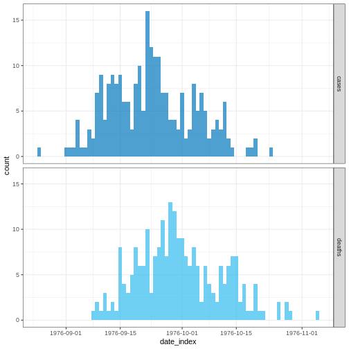
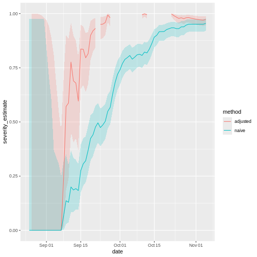

:::::::::::::::::::::::::::::::::::::: questions

- Pourquoi estime-t-on la gravité clinique d'une épidémie ?

- Comment peut-on estimer le risque de létalité (RL) au début d'une épidémie en cours ?

::::::::::::::::::::::::::::::::::::::::::::::::

::::::::::::::::::::::::::::::::::::: objectives

- Estimer le risque de létalité (RL) à partir de données épidémiologiques agrégées en utilisant la librairie `{cfr}`.

- Estimer le RL ajusté au délai épidémiologique à l'aide des librairies `{epiparameter}` et `{cfr}`.

- Estimer la sévérité ajustée au délai épidémiologique pour une série chronologique en expansion en utilisant le package `{cfr}`.

::::::::::::::::::::::::::::::::::::::::::::::::

::::::::::::::::::::::::::::::::::::: prereq

Les concepts abordés dans cet épisode supposent que vous êtes familiers avec :

**Science des données**: Programmation de base avec R.

**Théorie des épidémies**: [Distributions des délais](../learners/reference.md#delaydist).

**R packages installés**: `{cfr}`, `{epiparameter}`, `{outbreaks}`, `{tidyverse}`.

:::::::::::::::::::::::::::::::::

:::::::::::::: spoiler

Installer les packages si elles ne le sont pas déjà:


``` r
# si {pak} n'est pas disponible, exécutez : install.packages("pak")
pak::pak("cfr")
pak::pak("epiparameter")
pak::pak("tidyverse")
pak::pak("outbreaks")
```

Si vous recevez un message d'erreur, rendez-vous sur la [page principale de configuration](../learners/setup.md#configuration-des-logiciels).

::::::::::::::

## Introduction

Les questions les plus fréquentes au début d'une épidémie sont:

- Quel est l'impact probable de l'épidémie sur la santé publique en termes de gravité clinique ?
- Quels sont les groupes les plus gravement touchés ?
- L'épidémie risque-t-elle de provoquer une pandémie très grave ?

Nous pouvons évaluer le potentiel pandémique d'une épidémie à l'aide de deux mesures essentielles : la transmissibilité et la gravité clinique.
([Fraser et al. 2009](https://www.science.org/doi/full/10.1126/science.1176062),
[CDC, 2016](https://www.cdc.gov/flu/pandemic-resources/national-strategy/severity-assessment-framework-508.html)).

)](fig/cfr-hhs-scenarios-psaf.png){alt='L axe horizontal représente la mesure de la gravité clinique, échelonnée de 1 à 7, où 1 correspond à faible, 4 à modérée et 7 à très grave. L axe vertical représente la mesure de la transmissibilité, échelonnée de 1 à 5, où 1 correspond à faible, 3 à modérée et 5 à forte transmissibilité. Sur le graphique, les scénarios de planification d une pandémie sont présentés en quatre quadrants (A, B, C et D). De gauche à droite, les scénarios sont: “variation saisonnière”, “pandémie modérée”, “pandémie grave” et “pandémie très grave”. À mesure que la gravité clinique augmente sur l axe horizontal, ou que la transmissibilité augmente sur l axe vertical, la gravité du scénario de planification de la pandémie augmente également.'}

Une approche épidémiologique pour estimer la gravité clinique consiste à quantifier le risque de létalité (RL). Le risque de létalité est la probabilité conditionnelle de décès en cas de diagnostic confirmé, calculée comme le rapport entre le nombre cumulé de décès dus à une maladie infectieuse et le nombre de
cas diagnostiqués confirmés. Toutefois, le calcule de ce paramètre de cette façon au cours d'une épidémie tend à aboutir à un RL naïf ou biaisé, compte tenu du [délai](../../../learners/reference.md#delaydist) entre l'apparition de la maladie et le décès, qui varie considérablement au fur et à mesure que l'épidémie progresse et se stabilise aux derniers stades de l'épidémie ([Ghani et al. 2005](https://academic.oup.com/aje/article/162/5/479/82647?login=false#620743)).

![Estimations du risque de létalité (RL) observé biaisé confirmé en fonction du temps (ligne épaisse), calculé comme le rapport entre le nombre cumulé de décès et de cas confirmés à un instant $t$. La valeur atteinte à la fin d'une épidémie (~30 mai) est le risque de létalité observé à la fin de l'épidémie. La ligne horizontale continue et les lignes pointillées indiquent la valeur du RL prédit et leurs intervalles de confiance à 95% (IC $95%$) des valeurs prédites du taux de mortalité ajusté au délai en utilisant uniquement les données observées jusqu'au 27 mars 2003. ([Nishiura et al., 2009](https://journals.plos.org/plosone/article?id=10.1371/journal.pone.0006852))](fig/cfr-pone.0006852.g003-fig_c.png){fig-alt="Les périodes sont pertinentes : Période 1 -- 15 jours où le RL est nul, ce qui indique qu'aucun décès n'a été signalé ; Période du 15 mars au 26 avril où le RL semble augmenter ; Période du 30 avril au 30 mai où l'estimation du RL se stabilise."}

::::::::::::::::::::::: instructor

Les périodes sont pertinentes : Période 1 -- 15 jours où le RL est nul, ce qui indique qu'aucun décès n'a été signalé ; Période du 15 mars au 26 avril où le RL semble augmenter ; Période du 30 avril au 30 mai où l'estimation du RL se stabilise.

:::::::::::::::::::::::

Généralement, l'estimation de la gravité clinique d'une maladie peut être utile même en dehors d'un scénario de planification d'une pandémie et dans le contexte de la santé publique courante. Le fait de savoir si une épidémie a ou a eu une gravité différente de celle observée dans le passé peut motiver des recherches pour identifier les causes. Celles-ci peuvent être intrinsèques à l'agent infectieux (par exemple, une nouvelle souche plus grave) ou liées à des facteurs sous-jacents dans la population (par exemple, une immunité réduite ou des facteurs de morbidité) ([Lipsitch et al., 2015](https://journals.plos.org/plosntds/article?id=10.1371/journal.pntd.0003846)).

Dans ce tutoriel, nous allons apprendre à utiliser la librairie `{cfr}` pour calculer et ajuster le risque de gravité clinique en utilisant [la distribution des délais](../learners/reference.md#delaydist) obtenue de la librairie `{epiparameter}` ou de d'autres sources, sur la base des méthodes développées par [Nishiura et al. 2009](https://journals.plos.org/plosone/article?id=10.1371/journal.pone.0006852). Nous allons aussi explorer la libraire `{cfr}` pour determiner comment l'utiliser pour calculer d'autres mesures de sévérité clinique.

Nous utiliserons l'opérateur pipe (`%>%`) de la librairie `{magrittr}` pour relier facilement certaines fonctions de la librairie `{cfr}`, y compris les fonctions de la librairie de formatage de données `{dplyr}`. Nous chargerons donc la librairie `{tidyverse}`, qui comprend à la fois les librairies `{magrittr}` et `{dplyr}`.


``` r
# charger les packages
library(cfr)
library(epiparameter)
library(tidyverse)
library(outbreaks)
```

::::::::::::::::::: checklist

### L'opérateur double deux-points (`::`)

L'opérateur `::` de R permet d'accéder aux fonctions ou aux objets d'un package spécifique sans attacher l'intégralité du package (sans faire appel à la function `libray()`). Il offre plusieurs avantages, notamment :

* Indiquer explicitement le package d'origine d'une fonction, réduisant ainsi les ambiguïtés et les conflits potentiels lorsque plusieurs packages possèdent des fonctions portant le même nom.
* Permettre d'appeler une fonction depuis un package sans charger l'intégralité du package avec un appel à la fonction `library()`.

Par exemple, la commande `dplyr::filter(data, condition)` signifie que nous appelons la fonction `filter()` depuis la librairie `{dplyr}`.

:::::::::::::::::::

:::::::::::::::::::: discussion

Etiez-vous membre d'une équipe chargée de de concevoir des stratégies de réponse à une épidémie? Si oui:

- Comment évaluez-vous la gravité clinique de l'épidémie ?
- Quelles étaient les principales sources de biais ?
- Qu'aviez-vous fait pour prendre en compte les biais identifiés ?
- Quelle analyse complémentaire feriez-vous pour résoudre le biais ?

::::::::::::::::::::

## Sources de données pour la gravité clinique

Quelles sont les sources de données qu'on peut utiliser pour estimer la gravité clinique d'une épidémie? 
[Verity et al, 2020](https://www.thelancet.com/journals/laninf/article/PIIS1473-3099\(20\)30243-7/fulltext) résume le spectre des cas de COVID-19 :

30243-7/fulltext#gr1))](fig/cfr-spectrum-cases-covid19.jpg)

- Au sommet de la pyramide, les cas définis comme **grave** ou **critiques** selon les critères établis par l'OMS. Ces cas auraient probablement été identifiés en milieu hospitalier, présentant une pneumonie virale atypique. Ils auraient été identifiés en Chine continentale et parmi ceux classés au niveau international comme émanants d'une transmission locale.
- Beaucoup d'autres sont probablement **symptomatiques** (c'est-à-dire avec de la fièvre, de la toux ou des myalgies), mais ne nécessiteront peut-être pas d'hospitalisation. Ces cas auraient été identifiés grâce à leurs liens avec des voyageurs internationaux dans des zones à haut risque et grâce à la recherche des personnes en contact avec les cas confirmés. Ils pourraient être identifiés grâce à la surveillance de la population, par exemple en cas de syndrome grippal.
- La partie inférieure de la pyramide représente les cas **bénins** (et éventuellement **asymptomatiques**). Ces cas pourraient être identifiés par la recherche de cas contacts et, puis par des tests sérologiques.

## Estimation du risque de létalité (RL) naïf

Nous mesurons la gravité d'une maladie en termes de risque de létalité (RL). Le RL est interprété comme la probabilité conditionnelle de décès en cas de diagnostic confirmé, calculée comme le ratio du nombre cumulé de décès $D_{t}$ sur le nombre cumulé de cas confirmés $C_{t}$ à un moment donné $t$. Nous pouvons le référer au *RL naïf* (également RL brut ou biaisé, $b_{t}$) :

$$ b_{t} =  \frac{D_{t}}{C_{t}} $$

Cette formule est considérée comme *naïve* parce qu'elle tend à produire un RL biaisé et largement sous-estimé en raison du délai entre l'apparition de la maladie et le décès, qui ne se stabilise que vers la fin de l'épidémie.

Pour calculer le RL naïf à l'aide de la librairie `{cfr}`, on a besoin d'un tableau de données comportant au minimum trois colonnes nommées :

- `date`
- `cases`
- `deaths`

Explorons le tableau de données `ebola1976` inclus dans le package `{cfr}`, et qui contient les données provenant de la première épidémie d'Ebola au Zaïre (actuelle la République Démocratique du Congo) en 1976, comme l'ont analysé Camacho et al. (2014).


``` r
# charger le tableau de donnees ebola1976 du package {cfr}
data("ebola1976")

# Visualiser l'incidence du nombre de cas et de deces repertorie
ebola1976 %>%
  incidence2::incidence(
    date_index = "date",
    counts = c("cases", "deaths")
  ) %>%
  plot()
```



Nous supposerons que nous sommes dans le contexte d'une **épidémie d'Ebola en cours** où nous disposons que des données collectées durant les **30 premiers jours** de l'épidémie.


``` r
# supposons que nous disposons des donnees des 30 premiers jours de l'epidemie
ebola_30days <- ebola1976 %>%
  dplyr::slice_head(n = 30) %>%
  dplyr::as_tibble()

ebola_30days
```

``` output
# A tibble: 30 × 3
   date       cases deaths
   <date>     <int>  <int>
 1 1976-08-25     1      0
 2 1976-08-26     0      0
 3 1976-08-27     0      0
 4 1976-08-28     0      0
 5 1976-08-29     0      0
 6 1976-08-30     0      0
 7 1976-08-31     0      0
 8 1976-09-01     1      0
 9 1976-09-02     1      0
10 1976-09-03     1      0
# ℹ 20 more rows
```

:::::::::::::::::: callout

### Nous avons besoin de données d'incidence agrégées

Les données d'entrée des fonctions de la `{cfr}` sont des données d'incidence, qui sont ont été **agrégées** à partir des données de cas individuels.

<!-- Similaire à `{EpiNow2}`, mais `{cfr}` prend une colonne supplémentaire nommée `deaths`. -->


Ces données doivent être **agrégées** par “unité de temps”, c'est-à-dire une observation par unité de temps, contenant le nombre de cas et de décès signalés en un temps donné. Les observations avec des valeurs nulles ou manquantes doivent également être incluses, comme pour les données de séries temporelles.

Cependant, il faut noter que la version actuelle de `{cfr}` requière des données agrégées *journaliers*. Les autres unités temporelles d'agrégation de données telles que les semaines, mois, etc ne sont pour le moment pas pris en charge.

<!-- Proposez des moyens de traiter les données d'incidences hebdomadaires -->

<!-- https://github.com/epiverse-trace/cfr/issues/117 -->

::::::::::::::::::

:::::::::::: checklist

Lorsque vous regroupez les cas par jour avec `{incidence2}`, vous pouvez adapter les données pour `{cfr}` à l'aide de `cfr::prepare_data()` sur les objets `<incidence2>`. Pour plus de détails et un exemple, consultez le manuel de référence `{cfr}` sur la préparation des formats de données épidémiologiques courants pour l'estimation du CFR (https://epiverse-trace.github.io/cfr/reference/prepare_data.html).

::::::::::::

La fonction `cfr::cfr_static()` permet de calculer le RL naïf.


``` r
# Calculer le RL naïf durant les 30 premiers jours
cfr::cfr_static(data = ebola_30days)
```

``` output
  severity_estimate severity_low severity_high
1         0.4740741    0.3875497     0.5617606
```

:::::::::::::::::::::::::::::::::::::::: challenge

Téléchargez le fichier [sarscov2_cases_deaths.csv](data/sarscov2_cases_deaths.csv) et importez-le dans R. Puis estimez le RL naïf.

:::::::::::::::::::: hint

Vérifier le format des données d'entrée en répondant aux questions suivantes:

- Contient-il des données d'incidences quotidiennes ?
- Les noms des colonnes sont-ils conformes aux exigences de la fonction `cfr_static()` ?
- Comment renommer les noms de colonnes d'un tableau de données ?

::::::::::::::::::::

:::::::::::::::::::: solution

Importez les données téléchargées à l'aide de la fonction `readr::read_csv()`. Cette fonction reconnaît que la colonne `date` est de type `<Date>`.


``` r
# importer les données dans R
# supposons que le chemin d'accès au fichier est data/raw-data/ebola_cases.csv
sarscov2_input <- readr::read_csv(
  file = here::here("data", "raw-data", "sarscov2_cases_deaths.csv")
)
```


``` r
# voir un aperçu des données
sarscov2_input
```

``` output
# A tibble: 93 × 3
   date       cases_jpn deaths_jpn
   <date>         <dbl>      <dbl>
 1 2020-01-20         1          0
 2 2020-01-21         1          0
 3 2020-01-22         0          0
 4 2020-01-23         1          0
 5 2020-01-24         1          0
 6 2020-01-25         3          0
 7 2020-01-26         3          0
 8 2020-01-27         4          0
 9 2020-01-28         6          0
10 2020-01-29         7          0
# ℹ 83 more rows
```

Nous pouvons utiliser la fonction `cleanepi::standardize_column_names()` pour renommer les noms des colonnes de sorte qu'elles soient conforment aux exigences de la fonction `cfr::cfr_static()`.


``` r
# renommer les noms des colonnes
sarscov2_input <- sarscov2_input %>%
  cleanepi::standardize_column_names(
    rename = c(cases = "cases_jpn", deaths = "deaths_jpn")
  )

# estimer le RL naïf
cfr::cfr_static(sarscov2_input)
```

``` output
  severity_estimate severity_low severity_high
1        0.01895208   0.01828832    0.01963342
```

::::::::::::::::::::

::::::::::::::::::::::::::::::::::::::::

## Biais affectant l'estimation du CFR

::::::::::::::::::::::::::::: discussion

### Deux biais qui affectent l'estimation du RL

[Lipsitch et al, 2015](https://journals.plos.org/plosntds/article?id=10.1371/journal.pntd.0003846) ont décrit deux biais potentiels qui peuvent affecter l'estimation du RL (et comment y remédier) :

:::::::::::::::::::::::::::::

::::::::::::: solution

### 1. Études préférentielle des cas graves

Pour les maladies ayant un *spectre* de présentations cliniques, les cas qui sont portés à l'attention des autorités de santé publique et enregistrés dans les bases de données de surveillance sont généralement des personnes présentant les symptômes les plus graves, qui consultent un médecin, admises à l'hôpital ou décèdent.

Par conséquent, le RL sera généralement plus élevé chez les *cas confirmés* que dans l'ensemble de la population des cas, étant donné que cette dernière peut inclure des personnes présentant des symptômes légers, subcliniques et (selon certaines définitions de "cas") asymptomatiques.

:::::::::::::

:::::::::::: solution

### 2. Biais dû à une déclaration tardive du décès

Lors d'une épidémie *en cours*, il y a un délai entre le moment où une personne décède et le moment où son décès est signalé. Par conséquent, à tout moment, la liste des cas contient des individus qui vont mourir et dont le décès n'est pas encore survenu ou qui est survenu mais n'a pas encore été signalé. Ainsi, la division du nombre cumulé de décès déclarés par le nombre cumulé de cas déclarés en un moment donné d'une épidémie sous-évaluera le véritable RL.

Les principaux facteurs déterminants de l'ampleur du biais sont, le *taux de croissance de l'épidémie* et la *distribution des délais* entre la déclaration des cas et la déclaration des décès ; plus les délais sont longs, plus le taux de croissance est rapide, et plus le biais est important.

Dans les sections suivantes de cet épisode du tutoriel, nous allons nous concentrer sur les solutions concernant spécifiquement ce biais en utilisant la librairie `{cfr}`.

::::::::::::

:::::::::::::::::::: solution

### Étude de cas : Grippe A (H1N1), Mexique, 2009

Il est crucial d'améliorer l'estimation du RL ajusté au délais au début d'une épidémie pour déterminer sa virulence, mais aussi le niveau et les choix des interventions de santé publique et fournir des conseils au grand public.

En 2009, lors de l'épidémie de grippe porcine A (H1N1), le Mexique a effectué une estimation précoce biaisée du RL. Les premiers rapports du gouvernement mexicain faisaient état d'une infection virulente, alors que dans d'autres pays, le même virus était perçu comme bénin ([TIME, 2009](https://content.time.com/time/health/article/0,8599,1894534,00.html)).

Aux États-Unis et au Canada, aucun décès n'a été attribué au virus durant les dix jours qui ont suivi la déclaration d'urgence de santé publique par l'OMS. Même dans des circonstances similaires, au début d'une pandémie mondiale, les responsables de la santé publique, les décideurs et le grand public veulent connaître la virulence d'un agent infectieux émergent.

[Garske et al, 2009](https://www.bmj.com/content/339/bmj.b2840) évaluer les défis afin d'estimer la gravité de cette pandémie, en soulignant que le fait de recenser avec précision les cas pour le dénominateur peut améliorer la capacité à obtenir des estimations informatives du taux de létalité.

::::::::::::::::::::

:::::::::::::::::::: instructor

Vous trouverez plus d'informations concernant l'effet des délais dans l'estimation du RL dans cette section de la [vignette de la librairie `{cfr}` ](https://epiverse-trace.github.io/cfr/articles/cfr.html#concept-how-reporting-delays-bias-cfr-estimates).

<!-- créez un code et ensuite un .gif ? -->

::::::::::::::::::::

## RL ajusté au délai

[Nishiura et al, 2009](https://journals.plos.org/plosone/article?id=10.1371/journal.pone.0006852) ont développé une méthode de calcul du RL qui prend en compte les **délais** entre l'apparition des symptômes et le décès.

Durant certaines phases d'une épidémie en cours, il peut arriver que le nombre de décès soit insuffisant pour déterminer la distribution du temps entre l'apparition des symptômes et le décès. Par conséquent, nous pouvons obtenir une estimation de la *distribution de ce délai* à partir d'épidémies antérieures ou en réutilisant celles qui sont accessibles via des librairies R tels que `{epiparameter}` ou `{epireview}` qui les collectent à partir de la littérature scientifique publiée. Lisez l'épisode [accéder aux délais épidémiologiques](../episodes/delays-access.md) de ce tutoriel pour de plus amples informations.

Obtenons la distribution du délai entre la date d'apparition des symptômes et la
date de décès via la librairie `{epiparameter}`.


``` r
# obtenir la distribution du délai
onset_to_death_ebola <- epiparameter::epiparameter_db(
  disease = "Ebola",
  epi_name = "onset_to_death",
  single_epiparameter = TRUE
)

# visualiser la distribution du délai
plot(onset_to_death_ebola, xlim = c(0, 40))
```


Pour prendre en compte la distribution du délai lors du calcul le RL ajusté au délai, nous devons fournir à l'arguemt `delay_density` de la fonction `cfr::cfr_static()` la valeur correspondante.


``` r
# calculer le RL ajusté au délai pour les 30 premiers jours
cfr::cfr_static(
  data = ebola_30days,
  delay_density = function(x) density(onset_to_death_ebola, x)
)
```

``` output
  severity_estimate severity_low severity_high
1            0.9502        0.881        0.9861
```


Le RL ajusté au délai indique que la gravité globale de la maladie *à la fin de l'épidémie* ou selon les *récentes données disponibles à ce moment-là* est 0.9502 avec un intervalle de confiance de 95% entre 0.881 et 0.9861, légèrement supérieure à la valeur naïve.

:::::::::::::::::: spoiler

### Pourquoi density() est-elle exprimée comme une fonction de x ?

Pour corriger le biais résultant des cas dont les résultats ne sont pas encore connus au moment de l'estimation, {cfr} tient compte de la probabilité que le résultat d'un cas soit connu après un certain délai.

Pour ce faire, il relie $D_t$ à la fonction d'incidence $c_t$ (c'est-à-dire le nombre de nouveaux cas confirmés au jour t) et à la fonction de densité de probabilité conditionnelle $f_s$ du temps écoulé entre l'apparition de la maladie et le décès, étant donné le décès.

$$
D_t = p_t \times \sum_{i = 0}^t\sum_{j = 0}^\infty c_i f_{j - i}
$$

Ici, $D_t$ est le nombre cumulé de décès jusqu'au moment t, et $p_t$ est la proportion réalisée de cas confirmés qui décèdent des suites de l'infection (c'est-à-dire le risque de létalité non biaisé, ou CFR) .

Le terme $\sum_{i = 0}^t\sum_{j = 0}^\infty c_i f_{j - i}$ représente le **nombre total prévu de cas dont l'issue est connue au moment `t`**. Il additionne tous les cas incidents $c_i$, chacun pondéré par la fonction de densité de probabilité $f_{j−i}$ que leur issue soit connue après un délai de $j−i$ jours.

Chaque jour d'analyse, `{cfr}` calcule, pour chaque cas, le **nombre attendu de résultats à l'instant `t`**. Lorsque vous utilisez des objets de classe `<epiparameter>`, la fonction `density()` peut être appliquée pour obtenir la fonction de densité de probabilité correspondante pour chaque cas et chaque jour.

Par exemple, au jour 1, les résultats attendus sont égaux à :

- le nombre de cas observés au jour 1 multiplié par la densité au jour 0.


``` r
# Au jour 1, les résultats attendus sont :
ebola_30days$cases[1] *
  density(onset_to_death_ebola, at = 0)
```

``` output
[1] 0
```

Au jour 2, les résultats attendus sont égaux à :

- le nombre de cas observés au jour 1 multiplié par la densité au jour 1, plus
- le nombre de cas observés au jour 2 multiplié par la densité au jour 0


``` r
# Au jour 2, les résultats attendus sont les suivants :
ebola_30days$cases[1] *
  density(onset_to_death_ebola, at = 1) +
  ebola_30days$cases[2] *
    density(onset_to_death_ebola, at = 0)
```

``` output
[1] 0.06495664
```

Au troisième jour, les résultats attendus sont égaux à :

- le nombre de cas observés au premier jour multiplié par la densité au deuxième jour, plus
- le nombre de cas observés au deuxième jour multiplié par la densité au premier jour, plus
- le nombre de cas observés au troisième jour multiplié par la densité au jour 0.


``` r
# Au troisième jour, les résultats attendus sont :
ebola_30days$cases[1] *
  density(onset_to_death_ebola, at = 2) +
  ebola_30days$cases[2] *
    density(onset_to_death_ebola, at = 1) +
  ebola_30days$cases[3] *
    density(onset_to_death_ebola, at = 0)
```

``` output
[1] 0.08295091
```

Notez que les cas observés les plus récemment commencent la distribution des délais à partir de `0`, les autres continuent avec le jour suivant.

Étant donné que la valeur d'entrée dans `at` varie selon le jour pour chaque cas (`at = 0`, `at = 1`, `at = 2`, ...), la fonction `density()` doit être exprimée en fonction de x. `{cfr}` tirera alors les valeurs en conséquence, comme indiqué ci-dessous :

```r
# {cfr} utilise la densité de la distribution à différentes valeurs de x
function(x) density(onset_to_death_ebola, at = x)
```

En interne, la fonction `cfr::estimate_outcomes()` effectue ce calcul :


``` r
cfr::estimate_outcomes(
  data = ebola_30days,
  delay_density = function(x) density(onset_to_death_ebola, at = x)
) %>%
  slice_head(n = 3) %>%
  pull(estimated_outcomes)
```

``` output
[1] 0.00000000 0.06495664 0.08295091
```

::::::::::::::::::

:::::::::::::::::: callout

### Utilisation des objets de la classe epiparameter

Lorsque vous utilisez un object de la classe `<epiparameter>`, vous pouvez utiliser cette expression comme modèle :

`function(x) density(<NOM_OBJECT_EPIPARAMETER>, x)`

Pour les fonctions de distribution dont les paramètres ne sont pas disponibles dans `{epiparameter}` nous vous proposons deux alternatives :

- Créer un objet de la classe `<epiparameter>` pour l'intégrer dans d'autres packages R d'un pipeline d'analyse épidémiologique. Lisez l'article [document de référence de `epiparameter::epiparameter()`](https://epiverse-trace.github.io/epiparameter/reference/epiparameter.html) pour plus de clarifications.

- Liser la vignette de `{cfr}` portant sur [l'utilisation des distributions des délais](https://epiverse-trace.github.io/cfr/articles/delay_distributions.html).

::::::::::::::::::

:::::::::::::::::: spoiler

### Quand doit-on utiliser les distributions discrètes ?

Pour la fonction `cfr_static()` et les autres de la famille `cfr_*()`, les distributions les plus appropriées sont les **distributions discrets**. Ceci en raison du fait que nous travaillerons avec des données d'incidence quotidiennes sur le nombre de cas et de décès.

Nous pouvons supposer que l'évaluation de la fonction de distribution de probabilité (FDP) d'une distribution *continue* est équivalente à la fonction de masse de probabilité (FMP) de la distribution *discrète* correspondante.

Toutefois, cette hypothèse pourrait être inappropriée en présence de distributions présentant des pics énormes. C'est le cas, par exemple, des maladies dont la distribution du délai entre la date d'apparition des symptômes et la date du décès présente un pic très élevé et une faible variance. Dans ce cas, la disparité moyenne entre la FDP et la FMP devrait être plus prononcée que pour les distributions avec de larges variances. Une façon d'y remédier est de discrétiser la distribution continue en appliquant la fonction `epiparameter::discretise()` à un objet de la classe `<epiparameter>`.


``` r
onset_to_death_ebola %>%
  epiparameter::discretise() %>%
  plot(xlim = c(0, 40))
```


::::::::::::::::::

:::::::::::::::::::::::::::::::::::::::: challenge

Utilisez le même fichier ([sarscov2_cases_deaths.csv](data/sarscov2_cases_deaths.csv)) que celui du défi précédent pour:

- Estimer le RL ajusté au délai en utilisant la distribution de délai adéquate.
- Comparer les résultats du RL naïf et du RL ajusté au délai.

:::::::::::::::::::: hint

- Trouver l'objet de la classe `<epiparameter>` approprié pour ces données.

::::::::::::::::::::

:::::::::::::::::::: solution

Nous utiliserons la librairie `{epiparameter}` pour accéder à une distribution des délais pour les données d'incidence du SARS-CoV-2.


``` r
library(epiparameter)

sarscov2_delay <- epiparameter::epiparameter_db(
  disease = "covid",
  epi_name = "onset to death",
  single_epiparameter = TRUE
)
```

Les données seront importées dans R à l'aide de la fonction `readr::read_csv()`. Cette fonction reconnaît que la colonne `date` est de type `<Date>`.


``` r
# importer les donnees
# supposons que le chemin d'accès au fichier est: data/raw-data/ebola_cases.csv
sarscov2_input <- readr::read_csv(
  file = here::here("data", "raw-data", "sarscov2_cases_deaths.csv")
)
```


``` r
# voir un apperçu des donnees
sarscov2_input
```

``` output
# A tibble: 93 × 3
   date       cases_jpn deaths_jpn
   <date>         <dbl>      <dbl>
 1 2020-01-20         1          0
 2 2020-01-21         1          0
 3 2020-01-22         0          0
 4 2020-01-23         1          0
 5 2020-01-24         1          0
 6 2020-01-25         3          0
 7 2020-01-26         3          0
 8 2020-01-27         4          0
 9 2020-01-28         6          0
10 2020-01-29         7          0
# ℹ 83 more rows
```

Nous pouvons utiliser la fonction `cleanepi::standardize_column_names()` pour renommer les noms des colonnes de sorte qu'elles soient conforment à la fonction `cfr::cfr_static()`.


``` r
# renommer les noms des colonnes avant d'estimer le RL ajusté au délai
sarscov2_input %>%
  cleanepi::standardize_column_names(
    rename = c(cases = "cases_jpn", deaths = "deaths_jpn")
  ) %>%
  cfr::cfr_static(
    delay_density = function(x) density(sarscov2_delay, x)
  )
```

``` output
  severity_estimate severity_low severity_high
1            0.0734        0.071        0.0759
```

Comparer et interpréter les estimations du RL naïfs et ajusté au délais.

::::::::::::::::::::

::::::::::::::::::::::::::::::::::::::::

::::::::::::::::::::::::::: spoiler

### Comment fonctionne la librairie {cfr} ?

Pour ajuster le RL, [Nishiura et al. 2009](https://journals.plos.org/plosone/article?id=10.1371/journal.pone.0006852) ont utilisé les incidences des cas et des décès pour estimer le nombre de cas dont les pronostiques vitaux sont connus :

$$
u_t = \dfrac{\sum_{i = 0}^t
\sum_{j = 0}^\infty c_{i - j} f_{j}}{\sum_{i = 0} c_i},
$$

où :

- $c_{t}$ est l'incidence quotidienne des cas à l'instant $t$,
- $f_{t}$ est la valeur de la fonction de masse de probabilité (FMP) de la **distribution des délais** entre l'apparition des symptômes et le décès, et
- $u_{t}$ représente le facteur de sous-estimation des statuts vitals connus.

$u_{t}$ est utilisé pour **ajuster l'échelle** du nombre cumulé de cas au niveau du dénominateur dans le calcul du RL. Ce calcul est effectué en interne à l'aide de la fonction [`estimate_outcomes()`](https://epiverse-trace.github.io/cfr/reference/estimate_outcomes.html).

L'estimateur du RL peut être écrit comme suit :

$$p_{t} = \frac{b_{t}}{u_{t}}$$

où $p_{t}$ est la proportion réelle de cas confirmés qui meurent de l'infection (ou le RL non biaisé), et $b_{t}$ est l'estimation brute et biaisée du RL (ou RL naïf).

D'après cette dernière équation, nous observons que le RL non biaisé $p_{t}$ est plus élevé que le RL biaisé $b_{t}$, car le numérateur dans $u_{t}$ est plus petit que le dénominateur (notez que $f_{t}$ est la distribution de probabilité de la *distribution des délais* entre l'apparition des symptômes et le décès). Par conséquent, $b_{t}$ est considérer comme l'estimateur biaisé du RL.

Lorsque nous observons toute l'évolution d'une épidémie (de $t \rightarrow \infty$), $u_{t}$ tend vers 1, ce qui fait que $b_{t}$ tend à $p_{t}$ et devient un estimateur sans biais ([Nishiura et al., 2009](https://journals.plos.org/plosone/article?id=10.1371/journal.pone.0006852)).

:::::::::::::::::::::::::::

## Estimation du RL au début d'une épidémie

L'estimation du RL **naïf** est utile pour obtenir une estimation globale de la gravité d'une épidémie (jusqu'au moment $t$). À la fin de l'épidémie ou lorsqu'on atteint un niveau où on a de plus en plus de décès sont signalés, le RL estimé sera alors plus proche du "véritable" RL non biaisé.

Par ailleurs, la valeur RL **ajusté au délai** estimée au début d'une épidémie refléte mieux la gravité d'une maladie infectieuse émergente que le RL biaisé ou naïf obtenu au cours de l'épidémie.

Nous pouvons calculer le *RL ajusté au délai* au début d'une épidémie à l'aide de la fonction `cfr::cfr_rolling()`.

:::::::::::::::::::::: callout

`cfr::cfr_rolling()` est une fonction utilitaire qui calcule automatiquement le RL à chaque jour de l'épidémie à l'aide des données disponibles au jour de l'estimation, permettant ainsi à l'utilisateur de gagner du temps.

::::::::::::::::::::::

`cfr::cfr_rolling()` montre le RL estimé à chaque jour de l'épidémie, étant donné que les données futures sur les nombres de cas et de décès ne sont pas disponibles à ce moment-là. Pour un même jeu de données, la valeur finale de `cfr::cfr_rolling()` est identique à celle de `cfr::cfr_static()`.


``` r
# Calculer le RL naïf quotidien à chacun des 73 jours dans un jeu de donnees
# d'Ebola
rolling_cfr_naive <- cfr::cfr_rolling(data = ebola1976)
```

``` output
`cfr_rolling()` is a convenience function to help understand how additional data influences the overall (static) severity. Use `cfr_time_varying()` instead to estimate severity changes over the course of the outbreak.
```


``` r
# Calculer le RL quotidien ajusté au délai à chacun des 73 jours dans un jeu de
# donnees d'Ebola
rolling_cfr_adjusted <- cfr::cfr_rolling(
  data = ebola1976,
  delay_density = function(x) density(onset_to_death_ebola, x)
)
```

``` output
`cfr_rolling()` is a convenience function to help understand how additional data influences the overall (static) severity. Use `cfr_time_varying()` instead to estimate severity changes over the course of the outbreak.
```

``` output
Some daily ratios of total deaths to total cases with known outcome are below 0.01%: some CFR estimates may be unreliable.FALSE
```

Avec la fonction `utils::tail()` nous pouvons monter les dernières estimations du RL. On voit que les intervalles de confiance à 95% des valeurs naïves et corrigées se chevauchent.


``` r
# voir un aperçu des dernieres valeurs du RL
utils::tail(rolling_cfr_naive)
utils::tail(rolling_cfr_adjusted)
```

Visualisons maintenant les deux résultats dans une série chronologique. Quelle serait la performance des estimations naïves et ajustées au délai en temps réel ?


``` r
# concatener les deux resultats
dplyr::bind_rows(
  list(
    naive = rolling_cfr_naive,
    adjusted = rolling_cfr_adjusted
  ),
  .id = "method"
) %>%
  # visualiser les valeurs journalieres du RL naif et corrige
  ggplot() +
  geom_ribbon(
    aes(
      date,
      ymin = severity_low,
      ymax = severity_high,
      fill = method
    ),
    alpha = 0.2, show.legend = FALSE
  ) +
  geom_line(
    aes(date, severity_estimate, colour = method)
  )
```



Les lignes rouges et bleues représentent respectivement le RL journalier ajusté au délai et naïf tout au long de l'épidémie. Les bandes autour d'elles représentent les intervalles de confiance à 95% (IC 95%).

**Notez** que le calcul du RL ajusté au délai est particulièrement utile lorsqu'une *courbe épidémique de cas confirmés* est la seule donnée disponible (c'est-à-dire lorsque les données concernant le temps entre l'apparition des symptômes jusqu'au décès ne sont pas disponibles, comme c'est le cas au début de l'épidémie). Lorsqu'il y a peu ou pas de décès, une hypothèse sur la *distribution des délais* entre l'apparition des symptômes et le décès doit être formulée, par exemple à partir de la littérature basée sur les épidémies précédentes. [Nishiura et al. 2009](https://journals.plos.org/plosone/article?id=10.1371/journal.pone.0006852) illustrent ce phénomène dans les figures à l'aide de données relatives à l'épidémie de SARS survenue à Hong Kong en 2003.

:::::::::::::::::::::::::::::::::: spoiler

### Étude de cas : Épidémie de SARS, Hong Kong, 2003

Les figures A et B montrent les nombres cumulés de cas et de décès dus au SARS, et la figure C montre les estimations observées (biaisées) du RL en fonction du temps, c'est-à-dire le nombre cumulé de décès par rapport au nombre de cas à l'instant $t$. En raison du délai entre l'apparition des symptômes et le décès, l'estimation biaisée du RL au temps $t$ est inférieure au RL obtenu à la fin de l'épidémie (302/1755 = 17,2 %).

)](fig/cfr-pone.0006852.g003-fig_abc.png)

Néanmoins, même en n'utilisant que les données observées sur la période du 19 mars au 2 avril, `cfr::cfr_static()` peut produire une prédiction appropriée (figure D), par exemple le RL ajusté au délai au 27 mars est de 18,1% (IC 95% : 10,5 - 28,1). Une surestimation est notée au tout début de l'épidémie, mais les limites de l'intervalle de confiance à 95% pour les phases ultérieures incluent le RL réel (c'est-à-dire 17,2 %).

)](fig/cfr-pone.0006852.g003-fig_d.png)

::::::::::::::::::::::::::::::::::

:::::::::::::::::::::::::::::::::::::::::::: discussion

### Interpréter l'estimation du RL au début de l'épidémie

Sur la base de la figure ci-dessus :

- Quelle est la différence, en jours, entre la date à laquelle l'IC à 95% du *RL ajusté aux délais* et du *RL naïf* se croisent avec le RL estimé à la fin de l'épidémie ?

Discutez-en :

- En quoi le fait de disposer d'un RL *ajusté aux délai* peut-il influer sur les stratégies de santé publique ?

::::::::::::::::::::::::::::::::::::::::::::

:::::::::::::::::::::: hint

Nous pouvons soit inspecter visuellement ou analyser les tableaux des données de sortie.

::::::::::::::::::::::

:::::::::::::::::::::: instructor

Il y a presque un mois de différence.

Notez que l'estimation présente une incertitude considérable au début de la série chronologique. Après deux semaines, le RL corrigé au délai se rapproche de l'estimation globale du RL à la fin de l'épidémie.

Ce schéma est-il similaire à celui d'autres épidémies ? Nous vous invitons à utiliser les ensembles de données dans les défis de cet épisode pour le découvrir.

::::::::::::::::::::::

:::::::::::::::::::::: discussion

### Checklist

Avec `{cfr}` nous estimons le RL comme la proportion de décès parmi les cas **confirmés**.

En n'utilisant que les cas **confirmés** il est clair que tous les cas qui ne cherchent pas de traitement médical ou qui ne sont pas notifiés ne sont pas pris en compte, de même que tous les cas asymptomatiques. Cela signifie que le RL estimé est plus élevé que la proportion de décès parmi l'ensemble des personnes infectées.

::::::::::::::::::::::

::::::::::::::::::::::::::: solution

### Pourquoi les estimations naïves et ajustées aux délais diffèrent-elles ?

La méthode de la librairie `{cfr}` vise à obtenir un estimateur non biaisé "bien avant" d'observer toute l'évolution de l'épidémie. Pour ce faire, `{cfr}` utilise le facteur de sous-estimation $u_{t}$ pour estimer le RL non biaisé $p_{t}$ à l'aide de la méthode du maximum de vraisemblance, étant donné le *processus d'échantillonnage* défini par [Nishiura et al, 2009](https://journals.plos.org/plosone/article?id=10.1371/journal.pone.0006852).

:::::::::::::::::::::::::::

:::::::::::::::::::::::::: solution

### Quel est le processus d'échantillonnage ?

](fig/cfr-pone.0006852.g001.png)

Nous connaissons le nombre cumulé de cas confirmés et de décès $C_{t}$ et $D_{t}$ à l'instant $t$ à partir des *données d'incidence agrégées* et souhaitons estimer le RL non biaisé $\pi$ au moyen du facteur de sous-estimation $u_{t}$.

Si nous connaissions le facteur de sous-estimation $u_{t}$ nous pourrions préciser la taille de la population des cas confirmés qui ne sont plus à risque ($u_{t}C_{t}$, **ombré**), bien que nous ne sachions pas quels individus survivants appartiennent à ce groupe. Une proportion $\pi$ de ceux qui font partie du groupe de cas encore à risque (taille $(1- u_{t})C_{t}$, **non ombré**) devrait mourir.

Parce que chaque cas qui n'est plus à risque avait une probabilité indépendante de mourir, $\pi$ le nombre de décès, $D_{t}$ est un échantillon d'une distribution binomiale avec une taille d'échantillon de $u_{t}C_{t}$ et la probabilité de décès $p_{t}$ = $\pi$.

Ceci est représenté par la fonction de vraisemblance suivante permettant d'obtenir l'estimation du maximum de vraisemblance du RL non biaisé $p_{t}$ = $\pi$:

$$
{\sf L}(\pi | C_{t},D_{t},u_{t}) = \log{\dbinom{u_{t}C_{t}}{D_{t}}} + D_{t} \log{\pi} +
(u_{t}C_{t} - D_{t})\log{(1 - \pi)},
$$

Ce calcule est réalisé par la fonction interne `?cfr:::estimate_severity()`.

::::::::::::::::::::::::::

:::::::::::::::::::::::::: solution

### Limitations

- Le RL ajusté aux délais ne prend pas en charge toutes les sources d'erreur dans les données, telle que la non-détection de toutes les personnes infectées.

::::::::::::::::::::::::::

## Challenges

:::::::::::::::::::::::::::::::: discussion

### Autres mesures de sévérité

Supposons que nous ayons besoin d'évaluer la gravité clinique de l'épidémie dans un contexte autre aue la surveillance épidémiologique, comme la gravité parmi les cas qui arrivent à l'hôpital ou les cas que vous avez recueillis lors d'une enquête sérologique représentative.

En utilisant `{cfr}` nous pouvons modifier les valeurs du numérateur (`cases`) et du dénominateur (`deaths`) pour estimer des mesures plus sévères comme le risque d'infection mortelle (RIM) ou le risque d'hospitalisation mortelle (RHM). Nous pouvons suivre analogie ci-après :

::::::::::::::::::::::::::::::::

:::::::::::::::::::::::::::: solution

### Risque de létalité lié à l'infection et à l'hospitalisation

Si pour le risque de décès (RL) d'un *cas*, nous exigeons :

- les données sur l'incidence des cas et des décès, avec une
- distribution des délais entre les cas et les décès (ou une approximation proche, comme le délai entre l'apparition des symptômes et le décès).

Dans ce cas, le *risque d'infection mortelle (RIM)* nécessite :

- les données sur l'incidence des infections et des décès, avec une
- distribution des délais entre l'exposition et le décès (ou une approximation proche).

De la même manière, le *risque d'hospitalisation mortelle* requière :

- les données d'incidence des cas d'hospitalisation et de décès, ainsi qu'une
- distribution des délais entre l'hospitalisation et le décès.

::::::::::::::::::::::::::::::::

:::::::::::::::::::::::::::: solution

### Sources de données pour d'autres mesures de la gravité

[Yang et al, 2020](https://www.nature.com/articles/s41467-020-19238-2/figures/1) résume les différentes définitions et sources de données :


- sCFR risque de létalité des cas symptomatiques (sRL),
- sCHR risque d'hospitalisation des cas symptomatiques (sRH),
- mCFR risque de létalité des cas médicalement pris en charge (mRL),
- mCHR risque d'hospitalisation d'un cas médicalement pris en charge (mRH),
- HFR risque d'hospitalisation mortelle (RHM).

{fig-alt="Source des données sur les cas de COVID-19 à Wuhan : D1) 32 583 cas de COVID-19 confirmés en laboratoire en mars 84, D2) 17 365 cas de COVID-19 diagnostiqués cliniquement entre le 9 février et le 24 avril, D3) nombre quotidien de cas confirmés en laboratoire entre le 9 mars et le 24 avril, D4) nombre total de décès dus au COVID-19 en date du 24 avril, obtenus auprès de la Commission de la santé du Hubei3, D5) 325 cas confirmés en laboratoire et D6) 1 290 décès ont été ajoutés au 16 avril grâce à une vérification complète et systématique effectuée par les autorités de Wuhan3, et D7) 16 781 cas confirmés en laboratoire identifiés par le biais d'un dépistage universel10,11. Pse : sensibilité de la RT-PCR12. Pmed.care : proportion de patients souffrant d'infections respiratoires aiguës qui demandent une assistance médicale13."}

::::::::::::::::::::::::::::

::::::::::::::::: callout

### Les données agrégées diffèrent des données de cas individuels (linelist)

Les données d'incidence **agrégées** diffèrent des **linelist** où chaque observation contient des données concernant un cas individuel.


``` r
outbreaks::ebola_sierraleone_2014 %>% as_tibble()
```

``` output
# A tibble: 11,903 × 8
      id   age sex   status    date_of_onset date_of_sample district chiefdom   
   <int> <dbl> <fct> <fct>     <date>        <date>         <fct>    <fct>      
 1     1    20 F     confirmed 2014-05-18    2014-05-23     Kailahun Kissi Teng 
 2     2    42 F     confirmed 2014-05-20    2014-05-25     Kailahun Kissi Teng 
 3     3    45 F     confirmed 2014-05-20    2014-05-25     Kailahun Kissi Tonge
 4     4    15 F     confirmed 2014-05-21    2014-05-26     Kailahun Kissi Teng 
 5     5    19 F     confirmed 2014-05-21    2014-05-26     Kailahun Kissi Teng 
 6     6    55 F     confirmed 2014-05-21    2014-05-26     Kailahun Kissi Teng 
 7     7    50 F     confirmed 2014-05-21    2014-05-26     Kailahun Kissi Teng 
 8     8     8 F     confirmed 2014-05-22    2014-05-27     Kailahun Kissi Teng 
 9     9    54 F     confirmed 2014-05-22    2014-05-27     Kailahun Kissi Teng 
10    10    57 F     confirmed 2014-05-22    2014-05-27     Kailahun Kissi Teng 
# ℹ 11,893 more rows
```

:::::::::::::::::

:::::::::::::::::::::::::::::::::: challenge

### Utilisez {incidence2} pour réorganiser vos données

Utilisez la librairie `{outbreaks}` pour chargez le linelist des cas de MERS issues de l'objet `mers_korea_2015` .

Réorganisez cet objet linelist de sorte qu'il soit utilisable par les fonctions de la librairie `{cfr}`.

Estimez le RL ajusté au délai en utilisant la distribution de délai correspondante.

::::::::::::::::: hint

**Comment réorganiser les données d'entrée ?**

Le réorganisation des données d'entrée durant le processus d'analyse des données peut prendre beaucoup de temps. Pour obtenir des *données d'incidence agrégées* prêtes à être analysées nous vous encourageons à utiliser le package `{incidence2}`.

Tout d'abord, consultez la vignette [Get started](https://www.reconverse.org/incidence2/doc/incidence2.html) de la librairie `{incidence2}` pour savoir comment utiliser l'argument `date_index` lors de la lecture d'un linelist contenant plusieurs colonnes de type `<Date>`.

Ensuite, référez-vous [au manuel de référence](https://epiverse-trace.github.io/cfr/reference/prepare_data.html) sur la façon d'utiliser la fonction `cfr::prepare_data()` sur les objets de classe `<incidence2>`.

<!-- cite howto entry one lineslist + incidence2 + cfr connection -->

:::::::::::::::::

::::::::::::::::: solution


``` r
# charger les packages
library(cfr)
library(epiparameter)
library(incidence2)
library(outbreaks)
library(tidyverse)

# Acceder a la distribution des delais
mers_delay <- epiparameter::epiparameter_db(
  disease = "mers",
  epi_name = "onset to death",
  single_epiparameter = TRUE
)

# lire le linelist
mers_korea_2015$linelist %>%
  as_tibble() %>%
  select(starts_with("dt_"))
```

``` output
# A tibble: 162 × 6
   dt_onset   dt_report  dt_start_exp dt_end_exp dt_diag    dt_death  
   <date>     <date>     <date>       <date>     <date>     <date>    
 1 2015-05-11 2015-05-19 2015-04-18   2015-05-04 2015-05-20 NA        
 2 2015-05-18 2015-05-20 2015-05-15   2015-05-20 2015-05-20 NA        
 3 2015-05-20 2015-05-20 2015-05-16   2015-05-16 2015-05-21 2015-06-04
 4 2015-05-25 2015-05-26 2015-05-16   2015-05-20 2015-05-26 NA        
 5 2015-05-25 2015-05-27 2015-05-17   2015-05-17 2015-05-26 NA        
 6 2015-05-24 2015-05-28 2015-05-15   2015-05-17 2015-05-28 2015-06-01
 7 2015-05-21 2015-05-28 2015-05-16   2015-05-17 2015-05-28 NA        
 8 2015-05-26 2015-05-29 2015-05-15   2015-05-15 2015-05-29 NA        
 9 NA         2015-05-29 2015-05-15   2015-05-17 2015-05-29 NA        
10 2015-05-21 2015-05-29 2015-05-16   2015-05-16 2015-05-29 NA        
# ℹ 152 more rows
```

``` r
# utiliser {incidence2} pour determiner les incidences journalieres
mers_incidence <- mers_korea_2015$linelist %>%
  # convertir en objet incidence2
  incidence2::incidence(date_index = c("dt_onset", "dt_death")) %>%
  # completer les dates du début a la fin
  incidence2::complete_dates()

# voir un aperçu des donnees d'incidence
mers_incidence
```

``` output
# incidence:  72 x 3
# count vars: dt_death, dt_onset
   date_index count_variable count
   <date>     <chr>          <int>
 1 2015-05-11 dt_death           0
 2 2015-05-11 dt_onset           1
 3 2015-05-12 dt_death           0
 4 2015-05-12 dt_onset           0
 5 2015-05-13 dt_death           0
 6 2015-05-13 dt_onset           0
 7 2015-05-14 dt_death           0
 8 2015-05-14 dt_onset           0
 9 2015-05-15 dt_death           0
10 2015-05-15 dt_onset           0
# ℹ 62 more rows
```

``` r
# Preparer les donnees d'incidence pour utilisation dans {cfr}
mers_incidence %>%
  cfr::prepare_data(
    cases_variable = "dt_onset",
    deaths_variable = "dt_death"
  )
```

``` output
         date deaths cases
1  2015-05-11      0     1
2  2015-05-12      0     0
3  2015-05-13      0     0
4  2015-05-14      0     0
5  2015-05-15      0     0
6  2015-05-16      0     0
7  2015-05-17      0     1
8  2015-05-18      0     1
9  2015-05-19      0     0
10 2015-05-20      0     5
11 2015-05-21      0     6
12 2015-05-22      0     2
13 2015-05-23      0     4
14 2015-05-24      0     2
15 2015-05-25      0     3
16 2015-05-26      0     1
17 2015-05-27      0     2
18 2015-05-28      0     1
19 2015-05-29      0     3
20 2015-05-30      0     5
21 2015-05-31      0    10
22 2015-06-01      2    16
23 2015-06-02      0    11
24 2015-06-03      1     7
25 2015-06-04      1    12
26 2015-06-05      1     9
27 2015-06-06      0     7
28 2015-06-07      0     7
29 2015-06-08      2     6
30 2015-06-09      0     1
31 2015-06-10      2     6
32 2015-06-11      1     3
33 2015-06-12      0     0
34 2015-06-13      0     2
35 2015-06-14      0     0
36 2015-06-15      0     1
```

``` r
# Estimer le RL ajuste au delai
mers_incidence %>%
  cfr::prepare_data(
    cases_variable = "dt_onset",
    deaths_variable = "dt_death"
  ) %>%
  cfr::cfr_static(delay_density = function(x) density(mers_delay, x))
```

``` output
  severity_estimate severity_low severity_high
1            0.1377       0.0716        0.2288
```

:::::::::::::::::

::::::::::::::::::::::::::::::::::

:::::::::::::::::::::::::::::::::::::::::::::::::: challenge

### Hétérogénéité de la gravité

Le RL peut varier d'une population à l'autre (par exemple en fonction de l'âge, l'espace géographique, du traitement, etc) ; la quantification de ces hétérogénéités peut aider à mobiliser les ressources de manière appropriée et à comparer différents régimes de soins ([Cori et al., 2017](https://royalsocietypublishing.org/doi/10.1098/rstb.2016.0371)).

Utilisez le tableau de données `cfr::covid_data` pour estimer un RL ajusté aux délais, stratifié par pays.

::::::::::::::::::::::::: hint

Une façon d'effectuer une *analyse stratifiée* consiste à appliquer un modèle à des données imbriquées. Cette [vignette de la librairie `{tidyr}` vignette](https://tidyr.tidyverse.org/articles/nest.html#nested-data-and-models) vous montre comment appliquer la méthode `dplyr::group_by()` + `tidyr::nest()` aux données de imbriquées, puis `dplyr::mutate()` + `purrr::map()` pour appliquer le modèle.

:::::::::::::::::::::::::

::::::::::::::::::::::::: solution


``` r
library(cfr)
library(epiparameter)
library(tidyverse)

covid_data %>% dplyr::glimpse()
```

``` output
Rows: 20,786
Columns: 4
$ date    <date> 2020-01-03, 2020-01-03, 2020-01-03, 2020-01-03, 2020-01-03, 2…
$ country <chr> "Argentina", "Brazil", "Colombia", "France", "Germany", "India…
$ cases   <dbl> 0, 0, 0, 0, 0, 0, 0, 0, 0, 0, 0, 0, 0, 0, 0, 0, 0, 0, 0, 0, 0,…
$ deaths  <dbl> 0, 0, 0, 0, 0, 0, 0, 0, 0, 0, 0, 0, 0, 0, 0, 0, 0, 0, 0, 0, 0,…
```

``` r
delay_onset_death <- epiparameter::epiparameter_db(
  disease = "covid",
  epi_name = "onset to death",
  single_epiparameter = TRUE
)

covid_data %>%
  dplyr::group_by(country) %>%
  tidyr::nest() %>%
  dplyr::mutate(
    temp = purrr::map(
      .x = data,
      .f = cfr::cfr_static,
      delay_density = function(x) density(delay_onset_death, x)
    )
  ) %>%
  tidyr::unnest(cols = temp)
```

``` output
# A tibble: 19 × 5
# Groups:   country [19]
   country        data     severity_estimate severity_low severity_high
   <chr>          <list>               <dbl>        <dbl>         <dbl>
 1 Argentina      <tibble>            0.0133       0.0133        0.0133
 2 Brazil         <tibble>            0.0195       0.0195        0.0195
 3 Colombia       <tibble>            0.0225       0.0224        0.0226
 4 France         <tibble>            0.0044       0.0044        0.0044
 5 Germany        <tibble>            0.0045       0.0045        0.0045
 6 India          <tibble>            0.0119       0.0119        0.0119
 7 Indonesia      <tibble>            0.024        0.0239        0.0241
 8 Iran           <tibble>            0.0191       0.0191        0.0192
 9 Italy          <tibble>            0.0075       0.0075        0.0075
10 Mexico         <tibble>            0.0461       0.046         0.0462
11 Peru           <tibble>            0.0502       0.0501        0.0504
12 Poland         <tibble>            0.0186       0.0186        0.0187
13 Russia         <tibble>            0.0182       0.0182        0.0182
14 South Africa   <tibble>            0.0254       0.0253        0.0255
15 Spain          <tibble>            0.0087       0.0087        0.0087
16 Turkey         <tibble>            0.006        0.006         0.006 
17 Ukraine        <tibble>            0.0204       0.0203        0.0205
18 United Kingdom <tibble>            0.009        0.009         0.009 
19 United States  <tibble>            0.0111       0.0111        0.0111
```

C'est génial ! Vous pouvez maintenant utiliser un code similaire pour stratifier vos analyses en fonction de l'âge, des régions ou autres facteurs utiles.

Mais comment interpréter le fait qu'on ait une variabilité nationale de la gravité clinique pour un même agent pathogène diagnostiqué ?

Des facteurs locaux tels que la capacité de test, la définition de cas et le régime d'échantillonnage peuvent influer sur la déclaration des cas et des décès, et donc sur la détermination de la grvité clinique. Jetez un coup d'œil à la vignette de `{cfr}` sur [Estimation de la proportion de cas confirmés au cours d'une épidémie](https://epiverse-trace.github.io/cfr/articles/estimate_ascertainment.html).

:::::::::::::::::::::::::

::::::::::::::::::::::::::::::::::::::::::::::::::

## Annexe

La librairie `{cfr}` possède une fonction appelée `cfr_time_varying()` dont la fonctionnalité diffère de celle de `cfr_rolling()`.

::::::::::::::::: callout

### Quand doit-on utiliser cfr_rolling() ?

`cfr::cfr_rolling()` calcule le RL estimé à chaque jour de l'épidémie, vue que les données futures sur les cas et les décès ne sont pas disponibles à ce moment-là. La valeur finale de `cfr_rolling()` est identique à celle de `cfr_static()` pour les mêmes données.

Rappelez-vous, comme indiqué ci-dessus, `cfr_rolling()` est utile pour obtenir des estimations du RL à un stade précoce de l'épidémie et vérifier si l'estimation du RL d'une épidémie s'est stabilisée. C'est pourquoi, `cfr_rolling()` n'est pas sensible à la durée ou à la taille de l'épidémie.

:::::::::::::::::

::::::::::::::::: callout

### Quand doit-on utiliser `cfr_time_varying()` ?

D'autre part, `cfr::cfr_time_varying()`, utilisée pour calculer le RL mobile (RL par intervalle de temps régulier), aide à comprendre les variations du RL dues à des changements durant l'épidémie, comme par exemple en raison d'un nouveau variant du pathogène ou d'une immunité accrue due à la vaccination.

Cependant, `cfr_time_varying()` est sensible à l'incertitude de l'échantillonnage. Son résultat est donc sensible à la taille de l'épidémie. Plus le nombre de cas dont on connaitra le pronostique au moment de l'estimation est élevé, plus nous obtiendrons des estimations raisonnables du RL variable par intervalle de temps consécutif.

Par exemple, avec 100 cas, le taux de létalité estimé aura, grosso modo, un intervalle de confiance de 95% ± 10% de la valeur moyenne (IC binomial). Donc, si le nombre de cas dont on connaitra le pronostique à *un jour donné* est supérieur 100, nous pouvons obtenir des estimations raisonnables du RL mobile. Mais si nous disposons que de >100 cas *sur toute la durée de l'épidémie* nous devrons probablement nous appuyer sur la fonction `cfr_rolling()` qui utilise les données cumulées.

Nous vous invitons à lire la [vignette sur la fonction `cfr_time_varying()`](https://epiverse-trace.github.io/cfr/articles/estimate_time_varying_severity.html).

:::::::::::::::::

::::::::::::::::::::::::::::::::::::: keypoints

- Utilisez la librairie `{cfr}` pour estimer la gravité clinique

- Utilisez la fonction `cfr::cfr_static()` pour estimer le RL global à l'aide des plus récentes données disponibles.

- Utilisez la fonction `cfr::cfr_rolling()` pour obtenir les estimations du RL durant chaque jour de l'épidémie.

- Utiliser l'argument `delay_density` pour ajuster les valeurs du RL au délai épidémiologique en fonction de la distribution des délais correspondants.

::::::::::::::::::::::::::::::::::::::::::::::::

